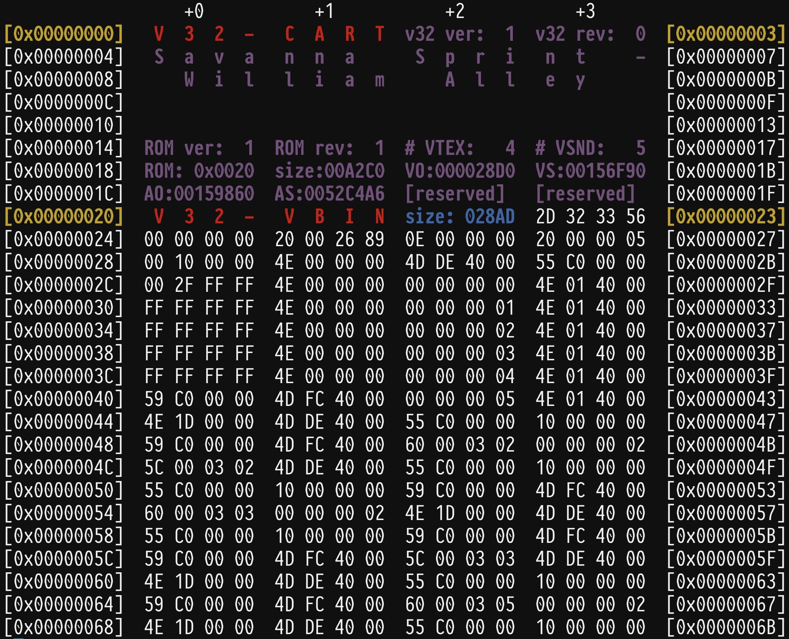
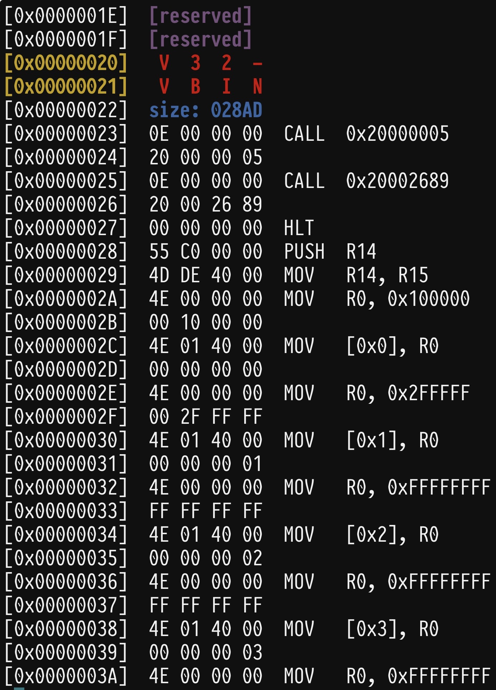
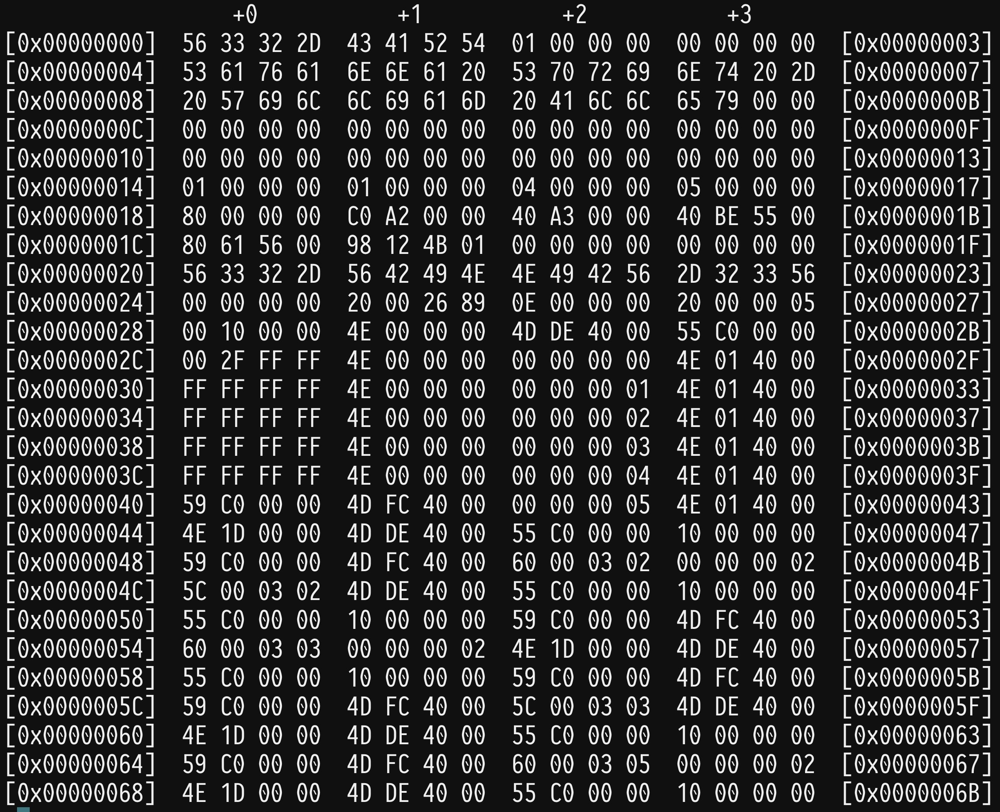

# v32tools

Vircon32 command-line binary and data analysis tools

## v32cat

Like the UNIX `cat` tool, **v32cat**  will display (in hex) and highlight
recognized sections of Vircon32-related data.

Meant  to  be  used  with  Vircon32 VBIN  object  files  and  V32  packed
cartridges.

The  aim is  to provide  a quick  and informative  means of  studying the
low-level  data in  the  cartridge,  be it  for  learning  about how  the
system works /  studying Computer Organization-style topics,  or to debug
problems.

While  other   text-based  hex-processing   tools  exist   (`xxd`,  `od`,
`hexdump`,  etc.), they  generally  want  to work  in  units of  singular
bytes, while  Vircon32's 32-bit  word size  and addressing  means without
significant reconfiguration,  the offsets  from these  other command-line
tools can be off by up to a factor of 4 (4 bytes = 1 V32 word). This adds
unnecessary overhead  to the typical exploration,  so **v32cat** attempts
to fill this niche.

**v32cat** supports `getopt(3)`-style command-line arguments. Run it with
the `-h` or `--help` argument to get  a list of available options you can
apply.

### default

By default, when not passed through a pipe or redirected, **v32cat** will
recognize V32 headers, highlight and render their content:

Since  most cartridges  will  likely  take up  way  more  space than  our
terminal allows, to avoid it defaulting to colorless, renderless mode, we
can run **v32cat** with the `--force` option.

### decode

With  the `--decode`  option, **v32cat**  will, for  the `VBIN`  section,
decode the raw  hex bytes and display the  disassembled Vircon32 assembly
code:

### raw

With all this fanciness, we may occasionally want to see everything as it
is; to do that, we run **v32cat** with the `--raw` option:

### VTEX pixels

It  will  even get  fancy  with  VTEX  pixels, de-endianifying  them  and
rendering them in the color of their respective channel:

## v32ls

Like the UNIX `ls` tool, **v32ls**  will output the found V32 headers and
common  attributes for  each  section.  Much as  **v32cat**  can do,  but
designed to be in a more top-down readable and concise format.

The idea is that  you can get a quick overview  of a particular cartridge
with **v32ls**,  then take that  information (offsets) and apply  them to
your pursuits with **v32cat**.
