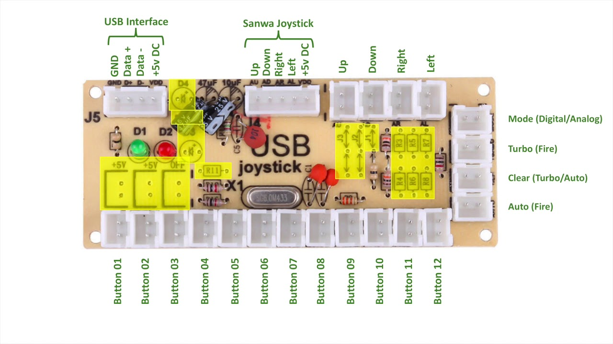
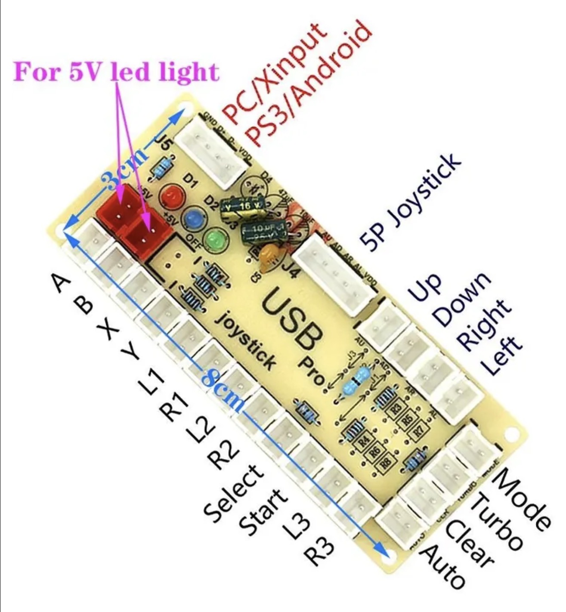
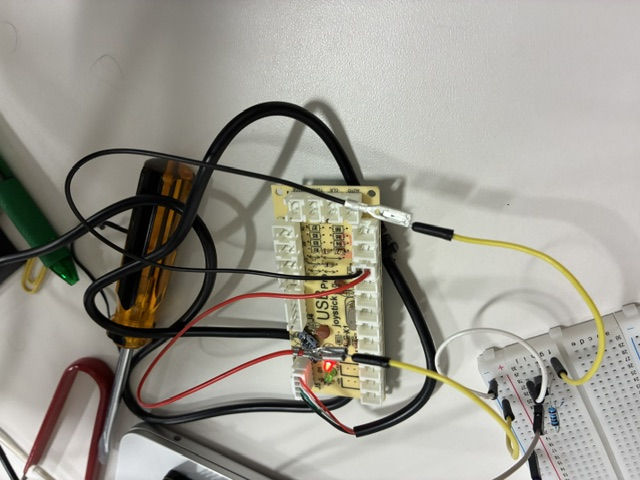
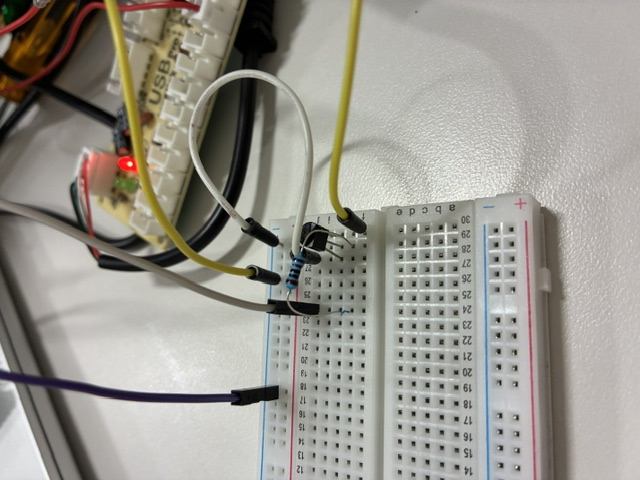

# ZERO DELAY USB ENCODER

A ready  made hardware solution, communicating  to the computer as  a USB
gamepad, providing per-button hardware breakouts for each gamepad input.

While these  boards are  intended to  be used in  the creation  of custom
arcade  controllers, they  should prove  useful for  our uses:  we're not
looking to  hook up physical  buttons or  switches, but instead  wire the
"button" connections into  the GPIO pins on a raspberry  pi, where we can
perform the keyboard access and input breakdown.

## HARDWARE DETAILS

Seems  I  have  the  `CY-822APro`,  with  silkscreened  `202201-1.0`  and
"gamecontrolboard" listed on the back of it.

While information  seems sparse, I  have obtained the  following labelled
images which I will use for reference:

### MORE GENERIC PINOUT



### MORE GAMEPAD SPECIFIC PINOUT



While there is  nothing binding us to these specific  pins, I will adhere
to this pinout for now simply to have a diagram to reference.

When configuring this  device for Vircon32, we'll  be establishing button
mappings anyway, so  really, as long as  the chain of custody  of the bit
positions is preserved, we'll be good.

## CONNECTING HARDWARE

When connecting via  USB to a Linux system, the  encoder board appears as
follows (via `dmesg`):

```
[ 4518.912764] usb 3-2.3: new full-speed USB device number 5 using xhci-hcd
[ 4519.005096] usb 3-2.3: New USB device found, idVendor=0079, idProduct=0006, bcdDevice= 1.07
[ 4519.005108] usb 3-2.3: New USB device strings: Mfr=1, Product=2, SerialNumber=0
[ 4519.005112] usb 3-2.3: Product: Generic   USB  Joystick
[ 4519.005115] usb 3-2.3: Manufacturer: SHANWAN
[ 4519.163320] input: SHANWAN Generic   USB  Joystick   as /devices/platform/axi/1000120000.pcie/1f00300000.usb/xhci-hcd.1/usb3/3-2/3-2.3/3-2.3:1.0/0003:0079:0006.0004/input/input9
[ 4519.163859] dragonrise 0003:0079:0006.0004: input,hidraw3: USB HID v1.10 Joystick [SHANWAN Generic   USB  Joystick  ] on usb-xhci-hcd.1-2.3/input0
```

And via `lsusb`:

```
Bus 003 Device 005: ID 0079:0006 DragonRise Inc. PC TWIN SHOCK Gamepad
```

## SUPPORT PACKAGES

While investigation board operations, I made use of the follow packages:

  * `joystick`
  * `evtest`

## PINOUT VOLTAGES

Before I  proceed, I need  to determine the  pinout voltages. I  know the
Raspberry  Pi GPIOs  are 3.3v,  and  I have  reason to  believe this  USB
ZERODELAY ENCODER board is working with 5v, but of course: verifying this
is important.

Okay, so after grabbing a voltmeter and doing some reading, it seems that
the button ports are using a "pull-up" circuitry- about 0.68v is measured
when the button isn't pressed, then will drop to 0.00v when the button is
pressed.

The wired connectors that came with  my board appear to be backwards: red
is the ground and black is the power.

After  some  playing,  I  got  a simple  circuit  figured  out  which  is
successfully allowing the pi to control the "button".

First  up, we  red (ground)  wire  is connected  to a  common ground  the
circuit uses (connected to a ground pin on the pi).

Then, the  black (power) wire  is connected to  the collector leg  of the
transistor:



The core of the circuit is an NPN S8050 transistor, hooked up as follows:

emitter (left leg when looking at flat side): connected to common ground.

base (middle leg when looking at flat  side): connected to GPIO pin on pi
via a 1K resistor.

collector (right leg  when looking at flat side): connected  to the black
(power) wire on the ZERO DELAY button port:



Setting the  GPIO pin to OUTPUT  mode, I can  then send the GPIO  HIGH or
LOW, and  when I  run `jstest` on  the connected gamepad,  I can  see the
desired button modulation.

We have liftoff!

So, I will  need to concoct something  with 7 S8050 transistors  and 7 1K
ohm resistors. That'll look a bit  messy, but it'll work. And yes: messy.
I now  have seven of  these button circuits,  enough to attempt  a viable
v32kbd test.

I wonder if  there's a way to wire up  transistors and resistors in-line,
without needing a breadboaard? The answer: use the female jumpers.

Now, to adapt getkey.c to use wiringpi.
